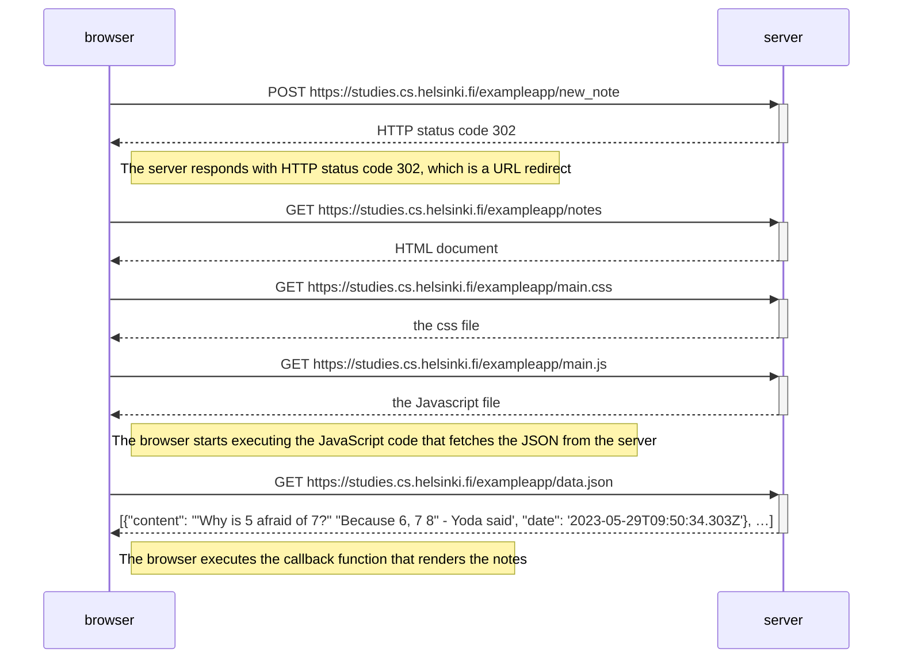

```mermaid
sequenceDiagram
  participant B as browser
  participant S as server
  
  B->>+S: POST https://studies.cs.helsinki.fi/exampleapp/new_note
  S-->>-B: HTTP status code 302

  Note right of B: The server responds with HTTP status code 302, which is a URL redirect

  B->>+S: GET https://studies.cs.helsinki.fi/exampleapp/notes
  S-->>-B: HTML document

  B->>+S: GET https://studies.cs.helsinki.fi/exampleapp/main.css
  S-->>-B: the css file

  B->>+S: GET https://studies.cs.helsinki.fi/exampleapp/main.js
  S-->>-B: the Javascript file

  Note right of B: The browser starts executing the JavaScript code that fetches the JSON from the server

  B->>+S: GET https://studies.cs.helsinki.fi/exampleapp/data.json
  S-->>-B: [{"content": '"Why is 5 afraid of 7?" "Because 6, 7 8" - Yoda said', "date": '2023-05-29T09:50:34.303Z'}, …]

  Note right of B: The browser executes the callback function that renders the notes
```
