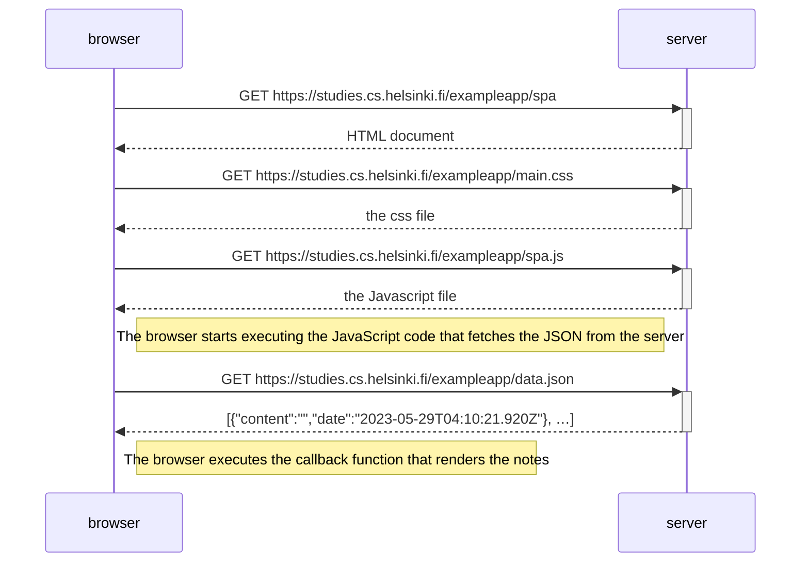

```mermaid
sequenceDiagram
  participant B as browser
  participant S as server
  
  B->>+S: GET https://studies.cs.helsinki.fi/exampleapp/spa
  S-->>-B: HTML document

  B->>+S: GET https://studies.cs.helsinki.fi/exampleapp/main.css
  S-->>-B: the css file

  B->>+S: GET https://studies.cs.helsinki.fi/exampleapp/spa.js
  S-->>-B: the Javascript file

  Note right of B: The browser starts executing the JavaScript code that fetches the JSON from the server

  B->>+S: GET https://studies.cs.helsinki.fi/exampleapp/data.json
  S-->>-B: [{"content":"","date":"2023-05-29T04:10:21.920Z"}, …]

  Note right of B: The browser executes the callback function that renders the notes
```
