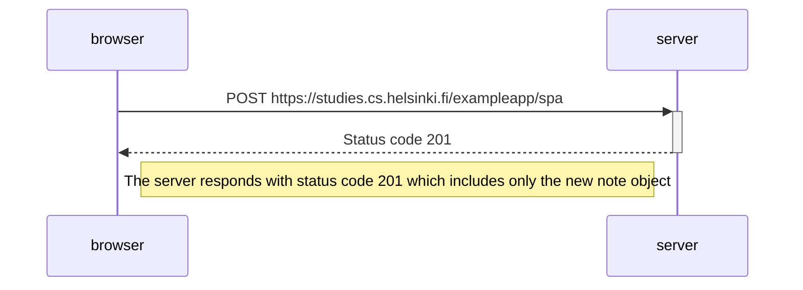

```mermaid
sequenceDiagram
  participant B as browser
  participant S as server
  
  B->>+S: POST https://studies.cs.helsinki.fi/exampleapp/spa
  S-->>-B: Status code 201

  Note right of B: The server responds with status code 201 which includes only the new note object
```
